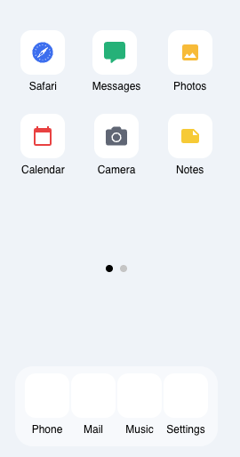

# 📱 iPhone UI - FiveM

A modern web-based UI for **FiveM phone scripts**, inspired by iPhone 14 design.  
Built using **Next.js App Router**, **TypeScript**, and **React Icons**.



---

## ✨ Features

- 🔳 iPhone-style app grid layout (fully responsive)
- 📥 Swipeable app pages with smooth navigation dots
- 🧼 Clean dock with glassmorphism effect
- 🎨 Wallpaper background just like iOS
- 🧩 Easy to extend with new apps or links
- ⚡️ Ultra fast and lightweight (Next.js + client components only)

---

## 🚀 Demo

> Coming soon – you can clone & run locally below 👇

---

## 🛠️ Stack

- [Next.js](https://nextjs.org/) (App Router)
- [TypeScript](https://www.typescriptlang.org/)
- [React Icons](https://react-icons.github.io/react-icons/)
- Custom inline CSS (no Tailwind, no frameworks)

---

## 🧪 Local Setup

```bash
git clone https://github.com/NeykinsDev/iphone-ui-fivem.git
cd iphone-ui-fivem
npm install
npm run dev
